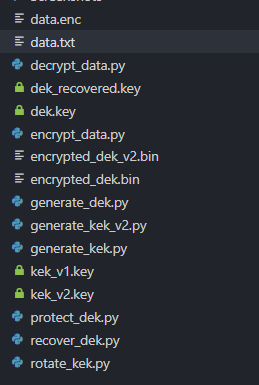
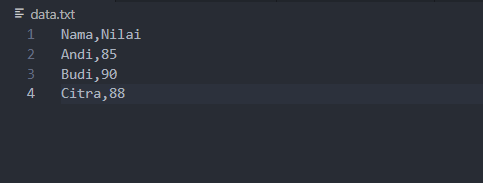
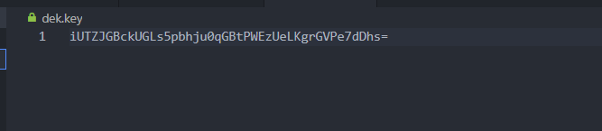
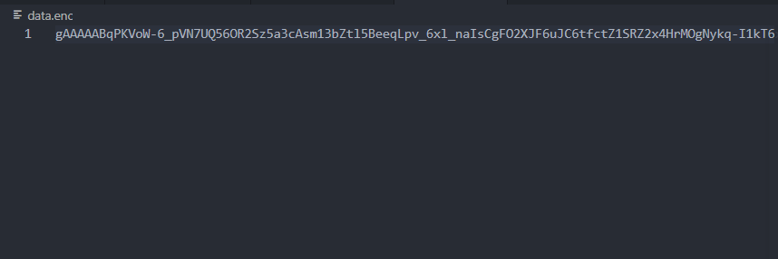
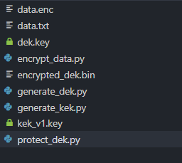
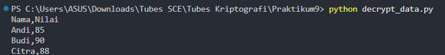

# Envelope Encryption & Key Rotation with Python

Implementasi konsep **Envelope Encryption**, **Data Encryption Key (DEK)**, **Key Encryption Key (KEK)**, dan **Key Rotation** menggunakan Python dengan library **Cryptography (Fernet)**.

Project ini dibuat sebagai bagian dari praktikum Kriptografi untuk memahami bagaimana sistem manajemen kunci modern melindungi data secara efisien tanpa perlu mengenkripsi ulang seluruh data ketika terjadi pergantian kunci.


## Hasil Akhir




# Deskripsi

Pada sistem kriptografi modern, data tidak dienkripsi langsung menggunakan master key. Sebagai gantinya digunakan beberapa lapisan kunci untuk meningkatkan keamanan dan mempermudah pengelolaan kunci.

Struktur yang digunakan pada praktikum ini adalah:

```text
Master Key
    │
    ▼
Key Encryption Key (KEK)
    │
    ▼
Data Encryption Key (DEK)
    │
    ▼
Plaintext Data
```

Pendekatan ini dikenal sebagai **Envelope Encryption** dan digunakan pada berbagai layanan manajemen kunci modern seperti:

* AWS KMS
* Azure Key Vault
* Google Cloud KMS


# Tujuan Praktikum

* Memahami konsep Data Encryption Key (DEK)
* Memahami konsep Key Encryption Key (KEK)
* Mengimplementasikan Envelope Encryption
* Melakukan enkripsi dan dekripsi data
* Melakukan proses Key Recovery
* Melakukan proses Key Rotation
* Memahami pentingnya manajemen kunci dalam keamanan informasi


# Teknologi yang Digunakan

* Python 3
* Cryptography (Fernet)


# Instalasi

Clone repository:

```bash
git clone <repository-url>
cd envelope-encryption-key-management
```

Install dependency:

```bash
pip install -r requirements.txt
```

Isi file `requirements.txt`:

```text
cryptography
```


# Cara Menjalankan

Jalankan file sesuai urutan berikut:

## 1. Membuat Data Encryption Key (DEK)

```bash
python generate_dek.py
```

## 2. Mengenkripsi Data Menggunakan DEK

```bash
python encrypt_data.py
```

## 3. Membuat Key Encryption Key (KEK)

```bash
python generate_kek.py
```

## 4. Melindungi DEK Menggunakan KEK

```bash
python protect_dek.py
```

## 5. Memulihkan DEK

```bash
python recover_dek.py
```

## 6. Mendekripsi Data

```bash
python decrypt_data.py
```

## 7. Membuat KEK Baru

```bash
python generate_kek_v2.py
```

## 8. Melakukan Key Rotation

```bash
python rotate_kek.py
```


# Struktur Project

```text
envelope-encryption-key-management/
│
├── data.txt
├── generate_dek.py
├── encrypt_data.py
├── generate_kek.py
├── protect_dek.py
├── recover_dek.py
├── decrypt_data.py
├── generate_kek_v2.py
├── rotate_kek.py
│
├── dek.key
├── dek_recovered.key
├── kek_v1.key
├── kek_v2.key
├── encrypted_dek.bin
├── encrypted_dek_v2.bin
├── data.enc
│
├── Screenshots/
│
├── requirements.txt
└── README.md
```


# Implementasi

## 1. Membuat Data Awal

Data plaintext yang akan diamankan selama praktikum.



---

## 2. Generate Data Encryption Key (DEK)

Membuat kunci enkripsi yang digunakan untuk mengenkripsi data.


### Hasil Key



---

## 3. Enkripsi Data Menggunakan DEK

Data plaintext dienkripsi menjadi ciphertext.


### Hasil Ciphertext




## 4. Generate Key Encryption Key (KEK)

KEK digunakan untuk melindungi DEK.


## 5. Protect DEK Menggunakan KEK

DEK dienkripsi menggunakan KEK dan disimpan dalam bentuk terenkripsi.


## 6. Struktur Folder Setelah Protect DEK




## 7. Recover DEK

Memulihkan DEK menggunakan KEK.


## 8. Dekripsi Data

Mengembalikan data ke bentuk semula menggunakan DEK hasil recovery.




## 9. Membuat KEK Baru

Persiapan untuk proses rotasi kunci.


## 10. Key Rotation

Memindahkan perlindungan DEK dari KEK versi lama ke KEK versi baru.


# Diagram Envelope Encryption

```text
Plaintext Data
      │
      ▼
Encrypt(DEK)
      │
      ▼
Encrypted Data (data.enc)

DEK
 │
 ▼
Encrypt(KEK)
 │
 ▼
encrypted_dek.bin
```


# Diagram Key Rotation

```text
encrypted_dek.bin
        │
        ▼
Decrypt (KEK v1)
        │
        ▼
       DEK
        │
        ▼
Encrypt (KEK v2)
        │
        ▼
encrypted_dek_v2.bin
```


# Studi Kasus: Suspected Key Exposure

Misalkan KEK versi pertama diketahui oleh pihak yang tidak berwenang.

Pada model tradisional, seluruh data harus dienkripsi ulang menggunakan kunci baru.

Namun dengan Envelope Encryption:

1. DEK dipulihkan menggunakan KEK lama.
2. Dibuat KEK baru.
3. DEK dienkripsi ulang menggunakan KEK baru.
4. Data terenkripsi tetap dapat digunakan tanpa perlu dienkripsi ulang.

Pendekatan ini membuat proses rotasi kunci jauh lebih efisien.


# Implementasi di Dunia Nyata

Konsep Envelope Encryption digunakan pada berbagai sistem modern yang membutuhkan keamanan tinggi dan pengelolaan kunci yang efisien, seperti:

* AWS Key Management Service (KMS)
* Azure Key Vault
* Google Cloud KMS
* Enterprise Key Management Systems
* Cloud Storage Encryption

Pendekatan ini memungkinkan organisasi melakukan rotasi kunci secara berkala tanpa perlu mengenkripsi ulang seluruh data yang tersimpan.


# Hasil yang Diperoleh

Implementasi berhasil menunjukkan konsep:

* Key Generation
* Key Storage
* Key Hierarchy
* Envelope Encryption
* Key Recovery
* Key Rotation

Keuntungan utama dari pendekatan ini adalah proses rotasi kunci dapat dilakukan tanpa perlu mengenkripsi ulang seluruh data yang telah tersimpan.


# Pembelajaran

Melalui praktikum ini saya memahami bahwa keamanan data tidak hanya bergantung pada algoritma enkripsi yang digunakan, tetapi juga pada bagaimana kunci kriptografi dikelola.

Konsep Envelope Encryption memungkinkan manajemen kunci dilakukan secara lebih aman dan efisien. Ketika terjadi kompromi pada KEK, proses rotasi dapat dilakukan tanpa harus mengenkripsi ulang seluruh data, sehingga menghemat waktu dan sumber daya sistem.

Prinsip ini menjadi fondasi berbagai layanan manajemen kunci modern yang digunakan pada lingkungan cloud maupun enterprise.


# Akademik

Praktikum ini dilaksanakan sebagai bagian dari pembelajaran mata kuliah Kriptografi pada Program Studi Informatika, Fakultas Teknologi Industri, Universitas Atma Jaya Yogyakarta.


# Author

**Michael Lim**

Mahasiswa Informatika

Fakultas Teknologi Industri

Universitas Atma Jaya Yogyakarta

